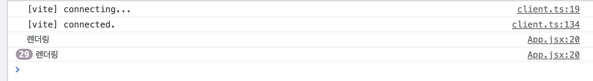
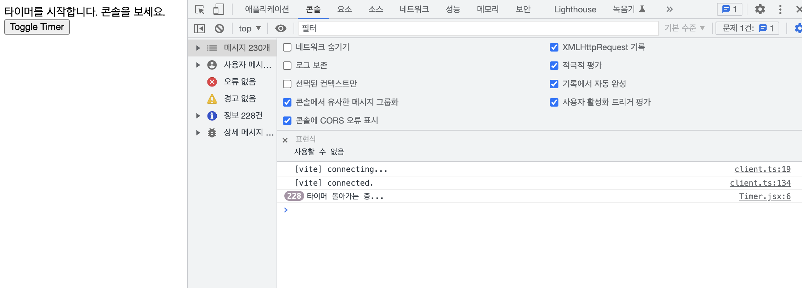

### useEffect 사용 case

- Mount: 화면에 첫 렌더링
- Update : 다시 렌더링
- Unmount: 화면에서 사라질 때

1. useEffect usage 1

- 렌더링 될 때 마다 실행
  - 컴포넌트가 맨 처음 화면에 렌더링 될 때
  - 컴포넌트가 다시 렌더링 될 때

```jsx
useEffect(() => {
  // 작업
});
```

1. useEffect usage 2

- 화면에 맨 처음 렌더링 될 때 실행
- value 값이 바뀔때 실행

```tsx
// 2. useEffect usage 2
useEffect(() => {
  // 작업
}, [value]);
// 화면에 첫 렌더링 될때 실행
// value 값이 바뀔때 실행
// 빈 [](배열) 값일 경우 화면에 첫 렌더링 될떄만 실행
// 여기서 빈 [](배열)은 dependency array
```

- clean up
  - return: 해당 컴포넌트가 Unmount 될때, 다음 useEffect가 실행되기 이전에 실행 됨

```tsx
useEffect(() => {
  // 구독

  return () => {
    // 구독 해지
    // document.removeEventListener
  };
}, []);
```

## useEffect 예제

---

### 1. useEffect 안에 조금이라도 무거운 작업을 하면 비효율적이다.

```tsx
function App() {
  const [count, setCount] = useState(1);
  const [name, setName] = useState('');

  const handleCountUpdate = () => {
    setCount(count + 1);
  };

  const handleInputChange = (e) => {
    setName(e.target.value);
  };

  // 렌더링 될 때마다 매번 실행됨
  useEffect(() => {
    console.log('렌더링');
  });

  return (
    <div>
      <button onClick={handleCountUpdate}>Update</button>
      <button>count: {count}</button>
      <input value={name} onChange={handleInputChange} />
      <span>{name}</span>
    </div>
  );
}

export default App;
```

input 값이 바뀔 때마다 렌더링 된다.



### 2. count가 업데이트 될 때만 렌더링 시키고 싶다면(name이 업데이트 될 땐 무시)

```tsx
// 2. Dependency array를 넣어주면
// - mount 될 때 (맨 처음 렌더링) &&
// - count가 바뀔 때 렌더링 || name이 바뀔 때
useEffect(() => {
  console.log('count 변화');
}, [count]);

useEffect(() => {
  console.log('count 변화');
}, [name]);
```

```tsx
// 맨 처음 마운트 될 때만 실행 시키고 싶다면
// 빈 dependency array
useEffect(() => {
  console.log('마운팅 변화');
}, []);
```

### 3. clean up

```tsx
// App.jsx

import React, { useState } from 'react';
import Timer from './component/Timer';

function App() {
  const [showTimer, setShowTimer] = useState(false);

  const handleToggle = () => {
    setShowTimer(!showTimer);
  };

  return (
    <div>
      {showTimer && <Timer />}
      <button onClick={handleToggle}>Toggle Timer</button>
    </div>
  );
}

export default App;
```

```tsx
// Timer.jsx

import React, { useEffect } from 'react';

const Timer = (props) => {
  useEffect(() => {
    const timer = setInterval(() => {
      console.log('타이머 돌아가는 중...');
    }, 1000);
  }, []);

  return (
    <div>
      <span>타이머를 시작합니다. 콘솔을 보세요.</span>
    </div>
  );
};

export default Timer;
```

- Timer 컴포넌트의 `setInterval` 을 정리하지 않아서 toggle버튼을 다시 눌러도 로그가 계속 찍힌다.



- useEffect 안에 `return` 부분에 정리 작업 코드를 넣어주면 cleanup이 된다.

```tsx
const Timer = (props) => {
  useEffect(() => {
    const timer = setInterval(() => {
      console.log('타이머 돌아가는 중...');
    }, 1000);

    return () => {
      // 정리작업 코드
      clearInterval(timer);
    };
  }, []);

  return (
    <div>
      <span>타이머를 시작합니다. 콘솔을 보세요.</span>
    </div>
  );
};

export default Timer;
```
