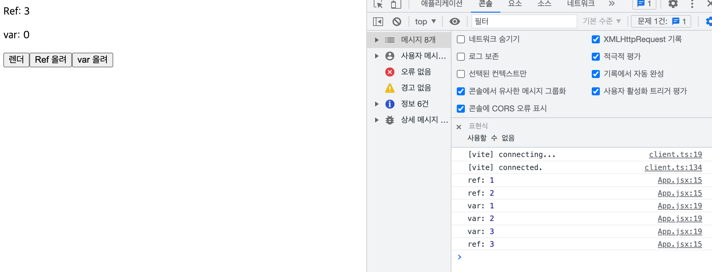

useRef는 unmout되기 전까지는 가지고 있는 값을 계속 유지할 수 있다

- 저장공간
  - state 변화 → 렌더링 → 컴포넌트 내부 변수들 초기화
  - Ref 변화 → no 렌더링 → 변수들의 값이 유지됨
- DOM요소에 접근
  - ref.focus()
    - login 화면이 렌더링 되고 Input 요소에 접근
    - vanilla js의 document.querySelector()와 비슷

useRef의 장점:

- 컴포넌트 안에 자주 바뀌는 값을 useState에 넣으면 계속 렌더링 되어 성능에 안좋은 영향을 끼침.
- useState 대신 useRef를 사용하면 그 값이 아무리 바뀌어도 렌더링을 발생시키지 않기 때문에 성능이 좋아짐.

---

useRef usage

```tsx
import React, { useRef } from 'react';
import { useState } from 'react';

function App() {
  const [renderer, setRenderer] = useState(0);

  const countRef = useRef(0);
  let countVar = 0;

  const handleRender = () => {
    setRenderer(renderer + 1);
  };
  const increaseRef = () => {
    countRef.current += 1;
    console.log('ref:', countRef.current);
  };
  const increaseVar = () => {
    countVar += 1;
    console.log('var:', countVar);
  };

  return (
    <div>
      <p>Ref: {countRef.current}</p>
      <p>var: {countVar}</p>
      <button onClick={handleRender}>렌더</button>
      <button onClick={increaseRef}>Ref 올려</button>
      <button onClick={increaseVar}>var 올려</button>
    </div>
  );
}

export default App;
```



Ref의 값은 3으로 변경된 반면에 var 값은 0이다.

그 이유는 `렌더` 버튼을 클릭했을 때, 함수가 다시 렌더링 되기 때문에 초기화가 되어 var 값은 0으로 초기화가 된다.

반면에 Ref값은 렌더링(초기화)이 되어도 변수들의 값이 유지된다.

### 결론: useRef는 변화는 감지해야 하지만 그 변화가 렌더링을 발생시키면 안되는 값을 다룰 때 사용
