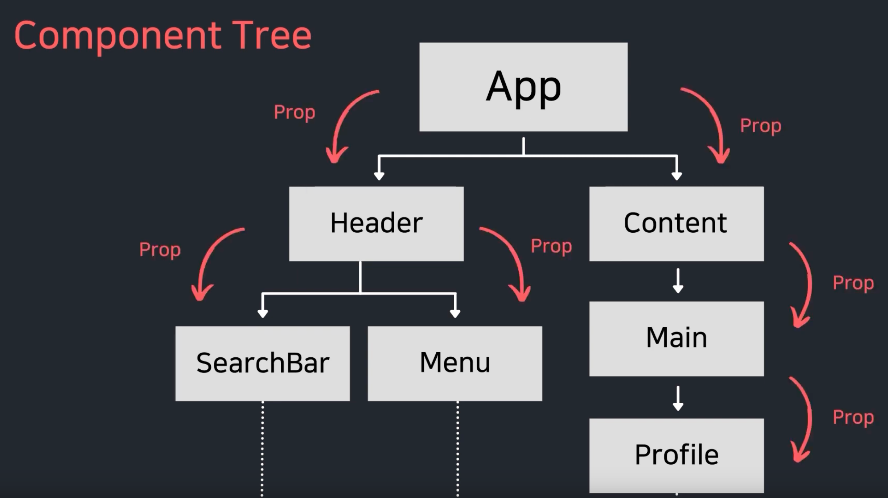
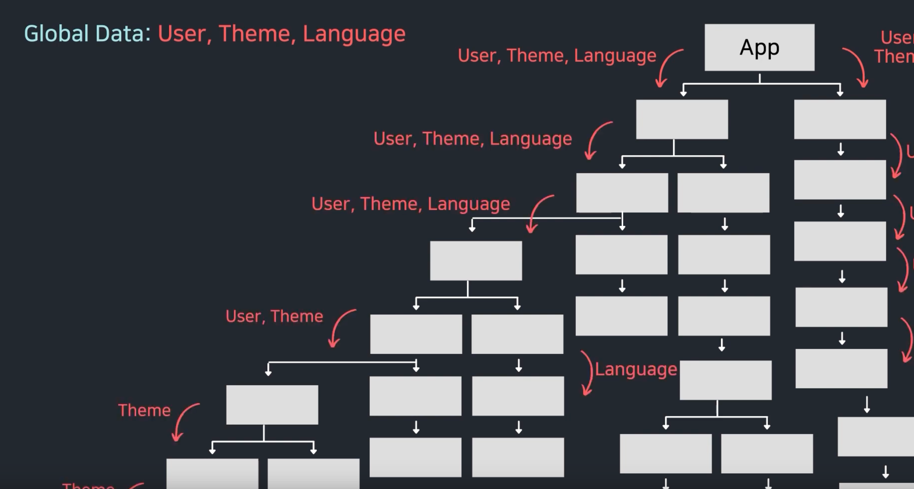
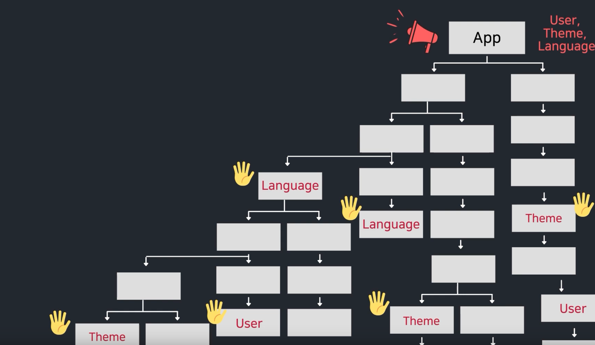
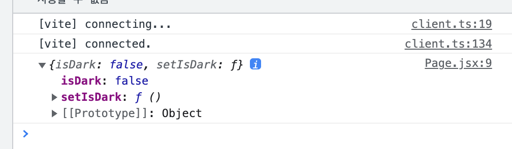
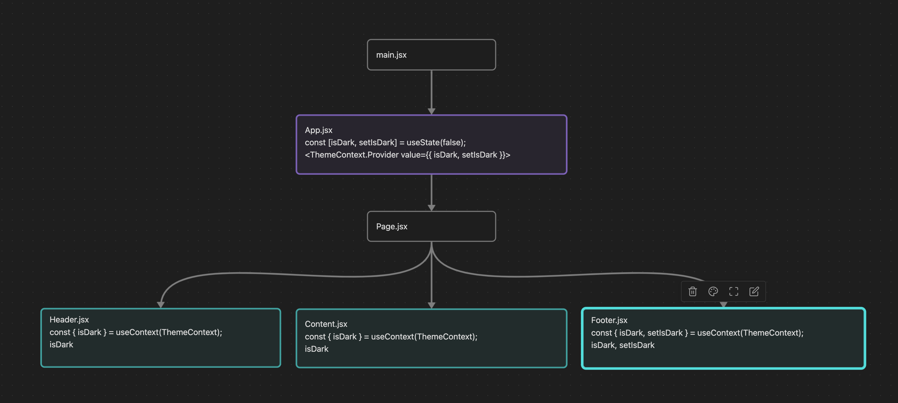
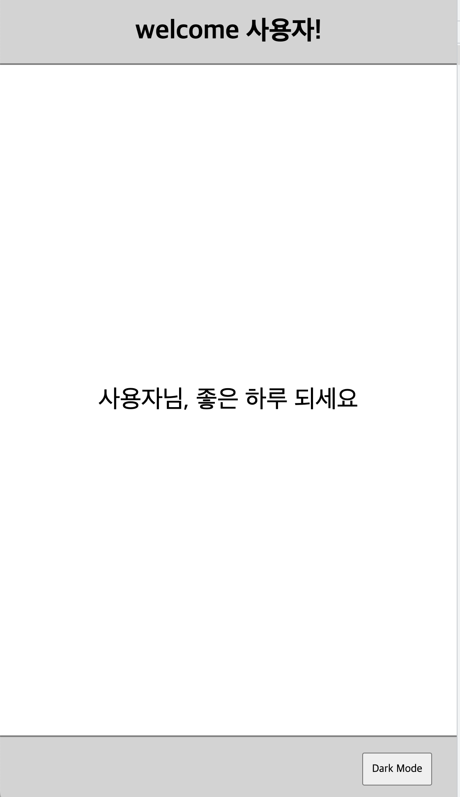

React는 부모 컴포넌트에 자식 컴포넌트로 `props`가 이동한다.

User 정보, theme color, 언어 등의 전역적인 data를 `Props`로 단계별로 전달하려면 복잡해진다.(Props drilling이 발생한다.)



`useContext`는 앱 안에서 전역적으로 사용하는 data들을 여러 컴포넌트들끼리 공유할 수 있게 제공해준다.



context는 꼭 필요할 때만 사용한다.

- context를 사용하면 컴포넌트를 재사용하기 어려워질 수 있다.
- prop drilling을 피하기 위한 목적이라면 component composition(컴포넌트 합성)을 먼저 고려해보자.

---

### useContext 사용 전, Prop drilling ver.

App.jsx

```tsx
import React from 'react';
import { useState } from 'react';
import './App.css';
import Page from './components/Page';

function App() {
  const [isDark, setIsDark] = useState(false);

  return <Page isDark={isDark} setIsDark={setIsDark} />;
}

export default App;
```

Page.jsx

```tsx
import React from 'react';
import Content from './Content';
import Footer from './Footer';
import Header from './Header';

function Page({ isDark, setIsDark }) {
  return (
    <div className="page">
      <Header isDark={isDark} />
      <Content isDark={isDark} />
      <Footer isDark={isDark} setIsDark={setIsDark} />
    </div>
  );
}

export default Page;
```

Header.jsx

```tsx
import React from 'react';

function Header({ isDark }) {
  return (
    <header
      className="header"
      style={{
        backgroundColor: isDark ? 'black' : 'lightgray',
        color: isDark ? 'white' : 'black',
      }}
    >
      <h1>welcome 관리자!</h1>
    </header>
  );
}

export default Header;
```

Content.jsx

```tsx
import React from 'react';

function Content({ isDark }) {
  return (
    <div
      className="content"
      style={{
        backgroundColor: isDark ? 'black' : 'white',
        color: isDark ? 'white' : 'black',
      }}
    >
      <p>관리자님, 좋은 하루 되세요</p>
    </div>
  );
}

export default Content;
```

Footer.jsx

```tsx
import React from 'react';

function Footer({ isDark, setIsDark }) {
  const toggleTheme = () => {
    setIsDark(!isDark);
  };
  return (
    <footer
      className="footer"
      style={{ backgroundColor: isDark ? 'black' : 'lightgray' }}
    >
      <button className="button" onClick={toggleTheme}>
        Dark Mode
      </button>
    </footer>
  );
}

export default Footer;
```

App.jsx에서 시작한 useState의 `isDark`와 `setIsDark`가 Prop drilling으로 삽입되었다.

---

### #2 useContext 사용 방법 - ThemeContext

- context 폴더 안에 ThemeContext.jsx 파일을 생성하고

```jsx
import { createContext } from 'react';

// 기본값 null
export const ThemeContext = createContext(null);
```

- App.jsx에 ThemeContext.provider를 감싼다.
- `value={{ isDark, setIsDark }}`
- 기존의 `isDark={isDark} setIsDark={setIsDark}`는 삭제한다.

```jsx
import React from 'react';
import { useState } from 'react';
import './App.css';
import Page from './components/Page';
import { ThemeContext } from './context/ThemeContext';

function App() {
  const [isDark, setIsDark] = useState(false);

  return (
    <ThemeContext.Provider value={{ isDark, setIsDark }}>
      <Page />
    </ThemeContext.Provider>
  );
}

export default App;
```

Page.jsx

- `{ isDark, setIsDark }` 삭제
- `const data = useContext(ThemeContext)`삽입

```jsx
import React, { useContext } from 'react';
import { ThemeContext } from '../context/ThemeContext';
import Content from './Content';
import Footer from './Footer';
import Header from './Header';

function Page() {
  const data = useContext(ThemeContext);
  console.log(data);

  return (
    <div className="page">
      {/* <Header isDark={isDark} />
      <Content isDark={isDark} />
      <Footer isDark={isDark} setIsDark={setIsDark} /> */}
    </div>
  );
}

export default Page;
```

data의 console.log는 App.jsx에서 `ThemeContext.Provider`전달해준 `isDark`, `setIsDark`가 있다.



다시 코드로 돌아와서,

- Page.jsx는 `isDark`, `setIsDark`가 필요없다 그러므로 삭제

```tsx
import Content from './Content';
import Footer from './Footer';
import Header from './Header';

function Page() {
  return (
    <div className="page">
      <Header />
      <Content />
      <Footer />
    </div>
  );
}

export default Page;
```

Header.jsx

- `useContext`는 react로부터 import
- `const { isDark } = useContext(ThemeContext)`
  - useContext로 `ThemeContext`를 가져오고, 구조분해할당으로 필요한 state인 {isDark}를 가져온다.

```tsx
import React, { useContext } from 'react';
import { ThemeContext } from '../context/ThemeContext';

function Header() {
  const { isDark } = useContext(ThemeContext);
  console.log(isDark); // false

  return (
    <header
      className="header"
      style={{
        backgroundColor: isDark ? 'black' : 'lightgray',
        color: isDark ? 'white' : 'black',
      }}
    >
      <h1>welcome 관리자!</h1>
    </header>
  );
}

export default Header;
```

Content.jsx

- Header.jsx와 마찬가지로 진행

```tsx
import React, { useContext } from 'react';
import { ThemeContext } from '../context/ThemeContext';

function Content() {
  const { isDark } = useContext(ThemeContext);
  return (
    <div
      className="content"
      style={{
        backgroundColor: isDark ? 'black' : 'white',
        color: isDark ? 'white' : 'black',
      }}
    >
      <p>관리자님, 좋은 하루 되세요</p>
    </div>
  );
}

export default Content;
```

Footer.jsx

- Header.jsx와 마찬가지로 진행 + setIsDark 추가

```tsx
import React, { useContext } from 'react';
import { ThemeContext } from '../context/ThemeContext';

function Footer() {
  const { isDark, setIsDark } = useContext(ThemeContext);

  const toggleTheme = () => {
    setIsDark(!isDark);
  };
  return (
    <footer
      className="footer"
      style={{ backgroundColor: isDark ? 'black' : 'lightgray' }}
    >
      <button className="button" onClick={toggleTheme}>
        Dark Mode
      </button>
    </footer>
  );
}

export default Footer;
```

### useContext 흐름



---

### #3 useContext 사용 방법 - UserContext

- UserContext.jsx 생성

```tsx
import { createContext } from 'react';

export const UserContext = createContext(null);
```

- UserContext.provider 가져오기

App.jsx

```tsx
import React from 'react';
import { useState } from 'react';
import './App.css';
import Page from './components/Page';
import { ThemeContext } from './context/ThemeContext';
import { UserContext } from './context/UserContext';

function App() {
  const [isDark, setIsDark] = useState(false);

  return (
    <UserContext.Provider value={'사용자'}>
      <ThemeContext.Provider value={{ isDark, setIsDark }}>
        <Page />
      </ThemeContext.Provider>
    </UserContext.Provider>
  );
}

export default App;
```

Header.jsx

```tsx
import React, { useContext } from 'react';
import { ThemeContext } from '../context/ThemeContext';
import { UserContext } from '../context/UserContext';

function Header() {
  const { isDark } = useContext(ThemeContext);
  const user = useContext(UserContext);
  console.log('user', user);
  console.log(isDark); // false

  return (
    <header
      className="header"
      style={{
        backgroundColor: isDark ? 'black' : 'lightgray',
        color: isDark ? 'white' : 'black',
      }}
    >
      <h1>welcome {user}!</h1>
    </header>
  );
}

export default Header;
```

Content.jsx

```tsx
import React, { useContext } from 'react';
import { ThemeContext } from '../context/ThemeContext';
import { UserContext } from '../context/UserContext';

function Content() {
  const { isDark } = useContext(ThemeContext);
  const user = useContext(UserContext);
  return (
    <div
      className="content"
      style={{
        backgroundColor: isDark ? 'black' : 'white',
        color: isDark ? 'white' : 'black',
      }}
    >
      <p>{user}님, 좋은 하루 되세요</p>
    </div>
  );
}

export default Content;
```




