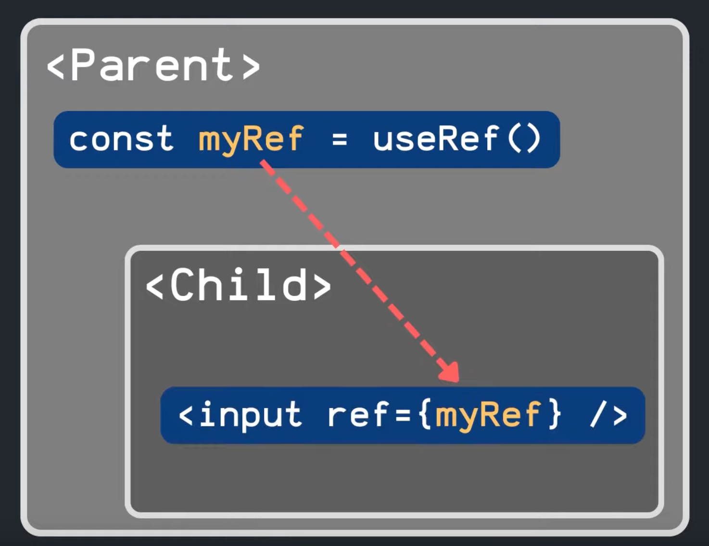
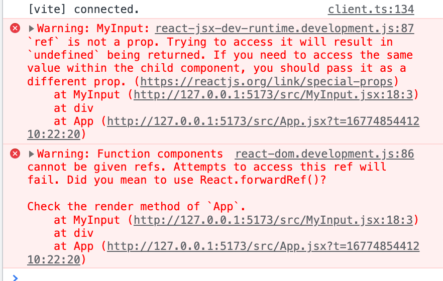

## forwardRef



---

### forwardRef 사용방법

App.jsx

```tsx
import React from 'react';
import { useRef } from 'react';
import MyInput from './MyInput';

function App() {
  const inputRef = useRef();

  const focus = () => {
    inputRef.current.focus();
  };

  return (
    <div>
      <MyInput ref={inputRef} />
      <button onClick={focus}>집중</button>
    </div>
  );
}

export default App;
```

MyInput.jsx

```tsx
import React from 'react';

function MyInput({ ref }) {
  return <input ref={ref} />;
}

export default MyInput;
```

보기에는 문제 없어보이지만, 아래와 같은 에러가 발생한다.

**오류 원인**:

- key라는 prop을 받아올 수 없는 것처럼 리액트는 ref라는 이름의 컴포넌트를 받아올 수 없다.
- 여기서 forwardRef를 사용하면 부모 컴포넌트로부터 자식 컴포넌트로 ref를 전달받을 수 있다.



### 오류 해결

MyInput.jsx

- forwardRef의 첫번째 인자: props, 두 번째 인자: ref
- 받아온 ref를 input 태그에 넣어준다

```tsx
import React, { forwardRef } from 'react';

const MyInput = forwardRef((props, ref) => {
  return <input ref={ref} />;
});

export default MyInput;
```

- `forwardRef` 를 export 하는 부분에 넣어 감싸줘도 된다.(취향차)

```tsx
import React, { forwardRef } from 'react';

const MyInput = (props, ref) => {
  return <input ref={ref} />;
};

export default forwardRef(MyInput);
```
