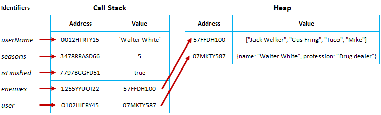

App.jsx

```tsx
import React from 'react';
import MyComponent from './component/MyComponent';

function App() {
  return (
    <div>
      <MyComponent>
        <li>One</li>
        <li>Two</li>
        <li>Three</li>
      </MyComponent>
    </div>
  );
}

export default App;
```

MyComponent.jsx

- props이 뭐가 오는지 모를 때 `children` 을 사용하면 App.jsx에서 `<MyComponent></MyComponent>` 사이에 있는 html이 오게 된다.

```tsx
import React from 'react';

function MyComponent({ children }) {
  return <div>{children}</div>;
}

export default MyComponent;
```

---

## props와 state 차이

### props

- Props는 Properties의 줄임말.
- Props는 상속하는 부모 컴포넌트로부터
  자녀 컴포넌트에 데이터등을 전달하는 방법
- Props는 읽기 전용(immutable)으로
  자녀 컴포넌트 입장에서는 변하지 않는다.
  (변하게 하고자 하면 부모 컴포넌트에서
  state를 변경시켜줘야한다.)

```tsx
<ChatMessages messages={messages} currentMember={currentMember} />
```

### state

- 부모 컴포넌트에서 자녀 컴포넌트로 데이터를 보내는게 아닌 해당 컴포넌트 내부에서 데이터를 전달하려면?
  State으로. 예를 들어서, 검색 창에 글을 입력할떄 글이 변하는것은 state을 바꿈
- State 는 변경 가능(mutable)
- State 이 변하면 re-render 된다.

```tsx
state = {
    message: '',
    attachFile: undefined,
    openMenu: false;
  }
```

---

### 자바스크립트 타입을 통한 불변성 의미

- 원시 타입은 불변성(immutable)을 가지고 있고 참조 타입(mutable) 은 그렇지 않다.
- 원시 타입:
  - Boolean, String, Number, null, undefined, Symbol
- 참조 타입:
  - Object, Array



- 기본적으로 JS는 원시타입에 대한 참조 및 값을 저장하기 위해 call stack 메모리 공간을 사용하지만 참조 타입의 경우 heap이라는 별도의 메모리 공간을 사용.
- 이 경우, call stack은 개체 및 배열 값이 아닌 메모리에만 heap 메모리 참조 id를 값으로 저장

---

### 불변성을 지켜야 하는 이유?

- 참조 타입에서 객체나 배열의 값이 변할 때 원본 데이터가 변경되기에 이 원본 데이터를 참조하고 있는 다른 객체에서 예상치 못한 오류가 발생할 수 있어서 프로그래밍의 복잡도가 올라간다.
- 리액트에서 화면을 업데이트할 때 불변성을 지켜서 값을 이전 값과 비교해서 변경된 사항을 확인한 후 업데이트하기 때문에 불변성을 지켜줘야 함.

---

### 불변성을 지키는 방법

- 참조 타입에서는 값을 바꿨을 때 Call Stack 주소 값은 같은데 Heap 메모리 값만 바꿔주기에 불변성을 유지할 수 없었으므로 아예 새로운 배열을 반환하는 메소드를 사용하면 된다.
- `spread operator`, `map`, `filter`, `slice`, `reduce`
- (사용하면 안됨!) 원본 데이터를 변경하는 메소드 => `splice`, `push`

```tsx
// 1.
const array = [1, 2, 3, 4];
const sameArray = array;
sameArray.push(5);

console.log(array === sameArray); // true

// 2.
const array = [1, 2, 3, 4];
const differentArray = [...array, 5];
console.log(array !== differentArray); // false
```


