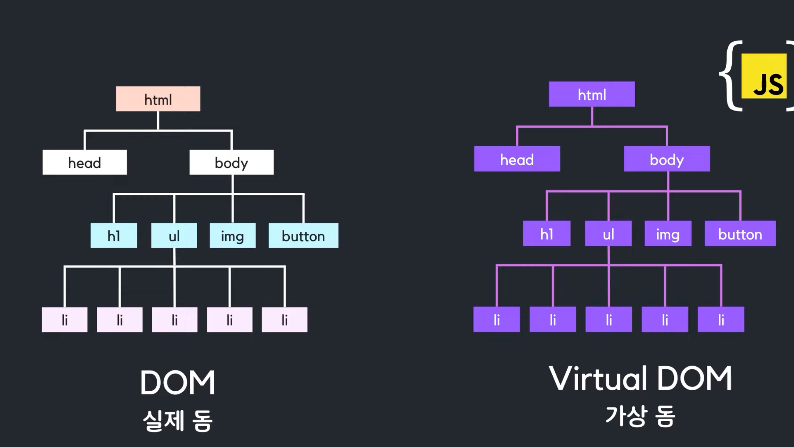
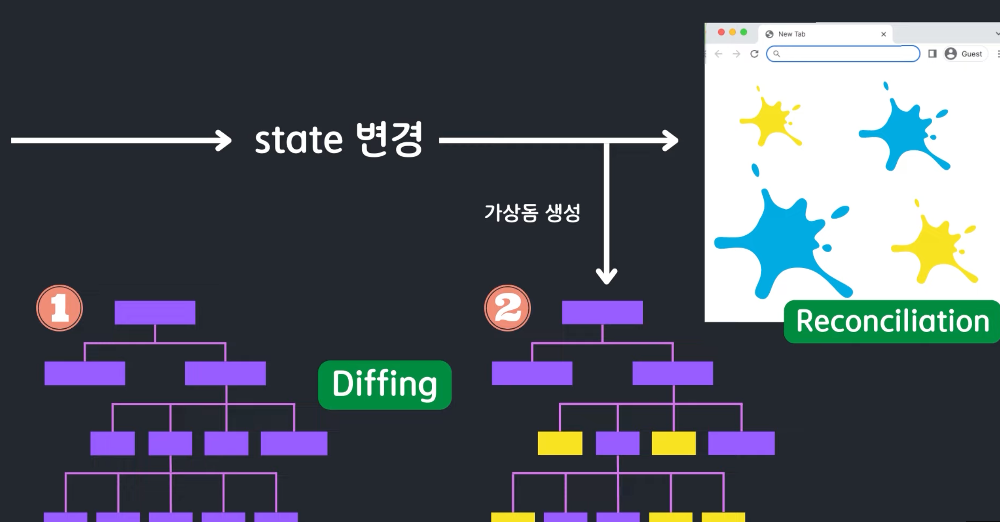

출처: [별코딩](https://www.youtube.com/watch?v=gc-kXt0tjTM)

JS의 DOM

- 브라우저가 html을 탐색해서 수정된 해당 element를 찾고 dom에서 제거
- 그리고 새롭게 수정된 element로 교체 → 브라우저에 다시 그려줌(render)
- 이런 과정이 매번 반복된다면 매우 비효율적으로 작용

가상 DOM

- 가상 DOM은 실제 DOM의 복사본
- 가상 돔은 실제 돔의 복사본, 실제 브라우저의 문서에 직접 접근할 수 없고 수정할 수 없다.
- 메모리에 저장된 JS의 객체이기 때문에 가상돔을 가법게 생성하고 접근 가능.
- 리액트는 2개의 가상돔을 가지고 있다.
  - 1번 가상돔: (렌더링 이전) 화면 구조를 나타내는 가상돔
  - 2번 가상돔: (렌더링 이후 보이게 될) 화면 구조를 나타내는 가상돔
    - state변경 → 가상돔 생성
    - 1번 가상돔과 비교해서 정확히 어느 element들이 변화됐는지 찾아냄 → `Diffing`
    - (Batch Update 덕분에 빠르게) 바뀐 부분만 재 렌더링 → Reconciliation → 재조정
      - Batch 10번 재 렌더링 되는게 아니라 바뀐 부분이 10개라면 10개가 한번에 업데이트됨

